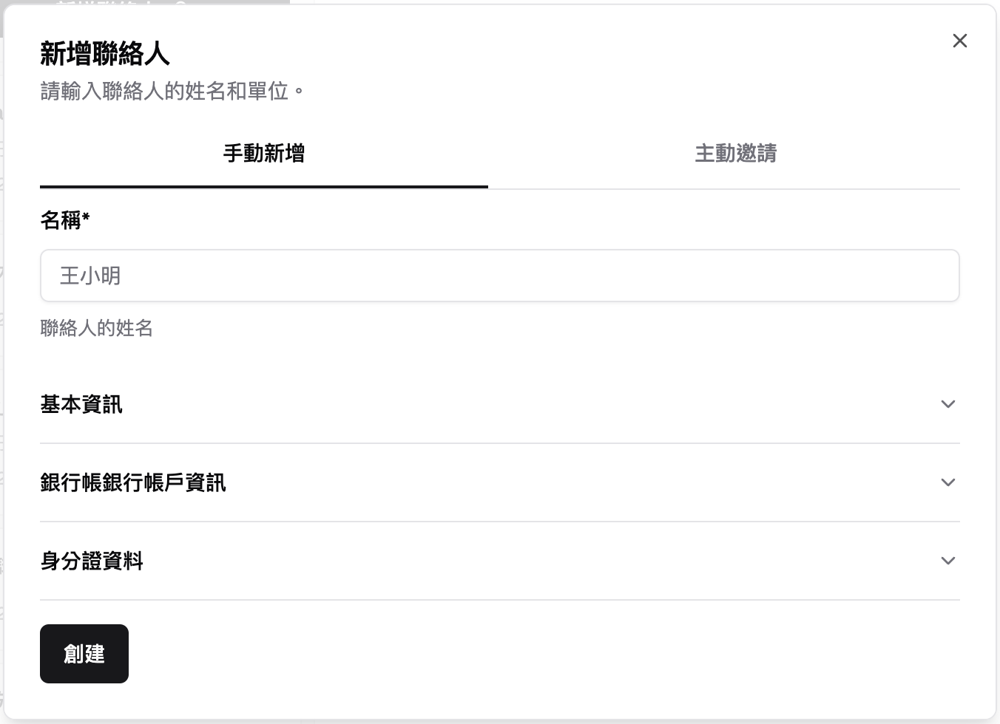
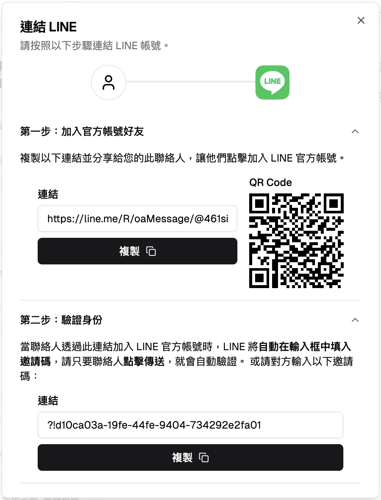
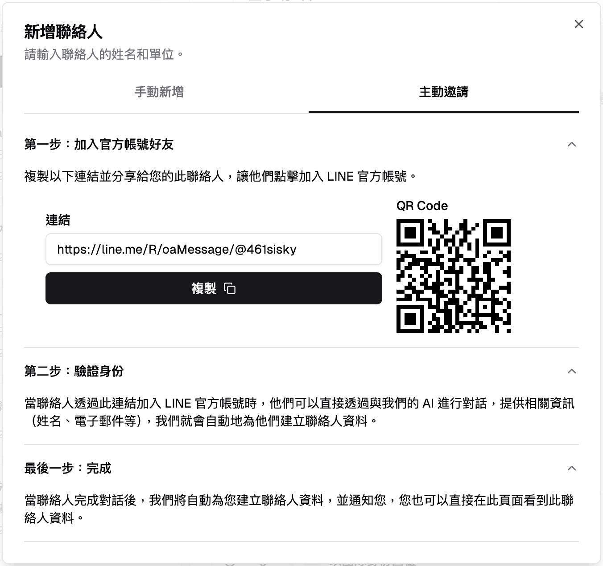
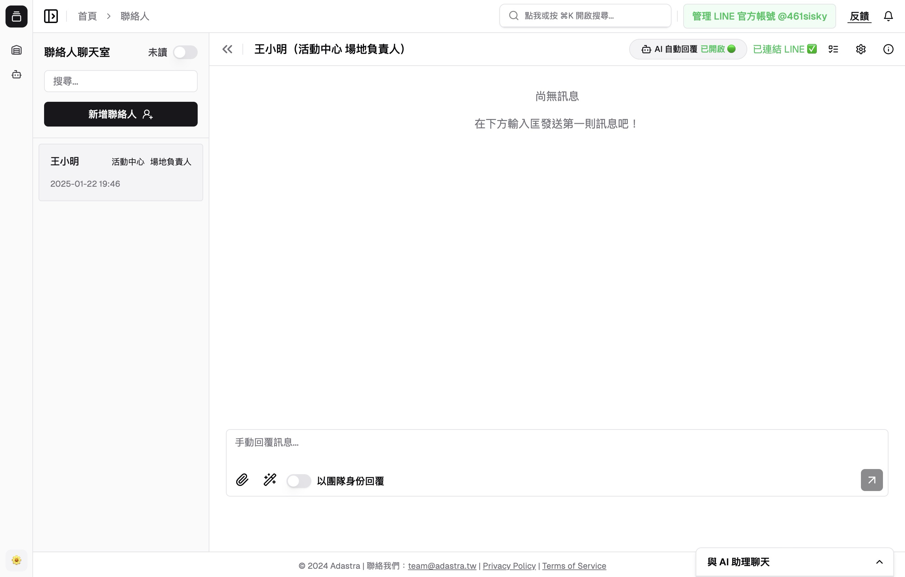
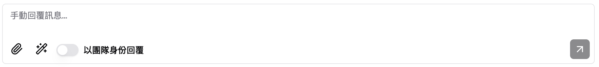
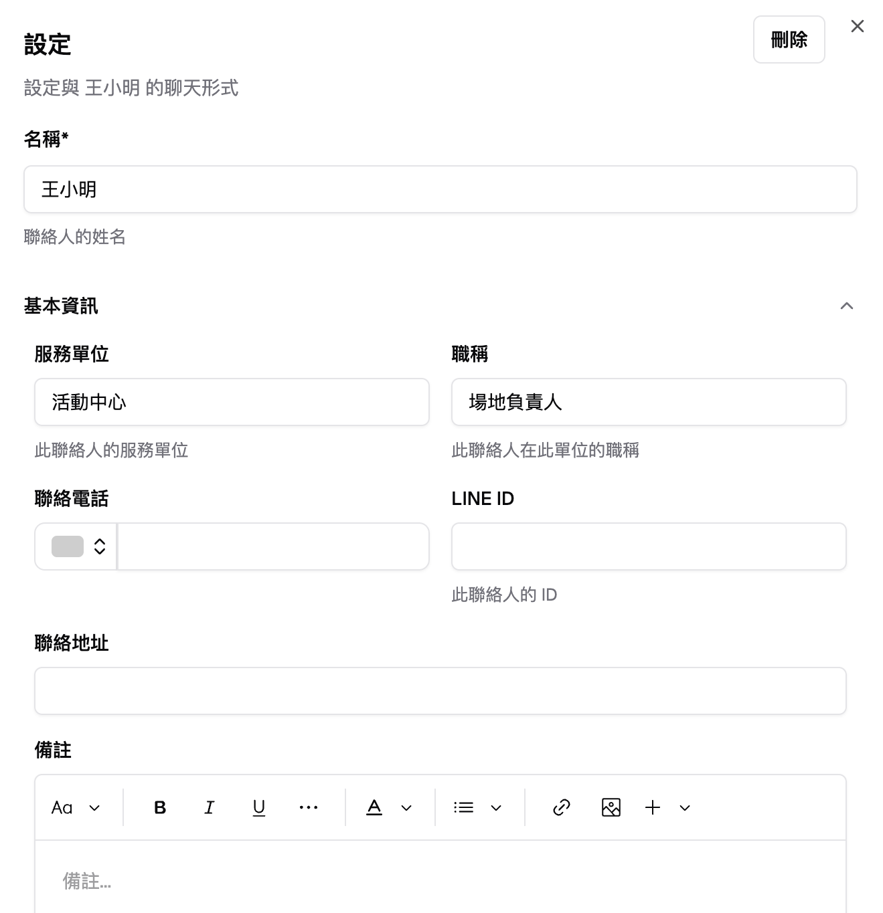

## 1. 什麼是聯絡人功能？

在工作中，我們常需要與不同的聯絡人（例如客戶、供應商）保持聯繫，並且管理彼此之間的對話與資訊。Adastra 的「聯絡人功能」整合了 **LINE 官方帳號** 作為主要的溝通管道，並提供了以下好處：

- **集中管理**：可以在同一個介面內，查看所有聯絡人的資訊、訊息紀錄。
- **AI 協助**：開啟 AI 自動回覆後，Adastra 能在您忙碌時，幫您回覆訊息或根據關鍵字對話，自動執行您指派的任務。
- **自動化流程**：將重複性工作（例如詢問聯絡人基本資料、確認需求）交給 AI，節省您的人力與時間。

換句話說，Adastra 能夠將聯絡人資訊管理與 LINE 聊天整合在一起，讓您不用在多個平台之間切換，一站式完成所有溝通與管理工作。

---

## 2. 準備工作

若您尚未完成 LINE 官方帳號設定，請先至 [快速開始教學](/docs/channels/getting-started) 依照步驟完成 LINE 官方帳號的連結與設定。  
一旦完成上述設定後，您可以前往 [Adastra 工作空間中的聯絡人管理介面](https://adastra.tw/dashboard/contacts) 開始管理聯絡人。

---

## 3. 如何新增聯絡人

在管理介面中，您將看到「新增聯絡人」按鈕。點擊之後，系統會提供兩種新增方式：**手動新增** 與 **主動邀請**。

### 3.1 手動新增

如果您已經擁有對方的聯絡資訊，可透過手動方式快速建立聯絡人：

1. **點擊「新增聯絡人」** → 選擇「手動新增」。
2. **輸入聯絡人姓名**：必要欄位，並可根據需要展開「基本資訊」、「銀行帳戶」、「身分證資料」等欄位。  
   
3. **點擊「創建」**：聯絡人就會顯示在您的聯絡人清單中。
4. **連結 LINE**：創建聯絡人後，系統會彈出「連結 LINE」對話視窗。請對方使用您的 LINE 官方帳號進行身分驗證。
   - 對方掃描 QR Code 或點擊連結 → 加入您的 LINE 官方帳號。
   - 對方在聊天視窗中會看到一段邀請碼（`!XXX...XXX`），只要按下傳送即可完成驗證。
   - 如果對方看不到邀請碼，請您重新發送邀請碼。
   - 您可隨時點擊「驗證並開始對話」按鈕檢查對方是否已完成驗證。  
     

### 3.2 主動邀請

若您想讓對方自動填寫資料並透過 AI 進行身分驗證，可以使用「主動邀請」方式：

1. **分享您的 LINE 官方帳號連結或 QR Code**：請對方掃描或點擊連結。  
   
2. **對方加入好友後**，AI 會提示他輸入基本資訊並進行身份驗證。
3. **驗證完成後**，對方就自動加入您的聯絡人清單，並可開始在 Adastra 介面與對方對話。

---

## 4. 聯絡人管理介面總覽

進入聯絡人管理介面後，您就能看到以下主要功能：

### 4.1 訊息整合

您可直接透過 Adastra 與聯絡人進行對話，所有訊息（包含文字、圖片、影片、檔案）都會在這裡呈現。  

- **檔案上傳**：點擊左下角「📎」上傳圖片、影片或其他檔案。
- **AI 改善回覆**：若不確定訊息要怎麼寫，可以點擊「🪄」按鈕，利用 AI 自動優化文字（例如「更清楚明瞭」、「繼續寫」等）。
- **發送者身份**：可選擇「代表團隊」或「代表個人」回覆，讓對方清楚知道回覆的身份。

### 4.2 聯絡人基本資訊

想要更新或查看聯絡人的詳細資訊（如姓名、電話、地址等），可以在右上角的「資訊」按鈕進行編輯或瀏覽。  

### 4.3 訊息通知

一旦有新訊息或任務，Adastra 會即時通知您，確保您不會錯過任何重要對話或詢問。

### 4.4 AI 自動回覆

開啟 AI 自動回覆後，系統會依據對方的訊息自動進行回覆或執行您設定的任務。

- **智慧對答**：AI 會根據使用者提問，給予對應的回答。
- **任務管理**：您可以在右上角按鈕中找到指派給 AI 的任務，隨時查看進度。
- **重要訊息整理**：AI 會將關鍵資訊歸納後通知您，讓您第一時間掌握狀況。

---

## 結語

透過 Adastra 聯絡人功能，您能夠輕鬆管理與客戶、供應商等各方的聯繫，並且結合 LINE 官方帳號與 AI 來進行自動回覆或任務處理。  
如果在使用過程中遇到任何問題，請隨時 [聯絡我們](https://adastra.tw/#contact)，以獲得更進一步的協助。

希望此手冊能協助您在最短時間內順利上手，讓聯絡人管理變得更聰明、更有效率！
