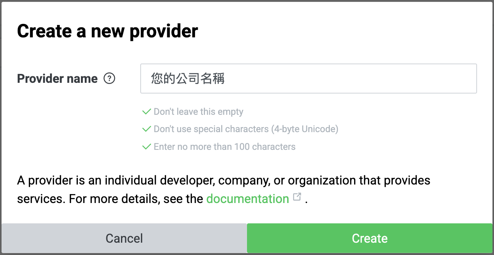
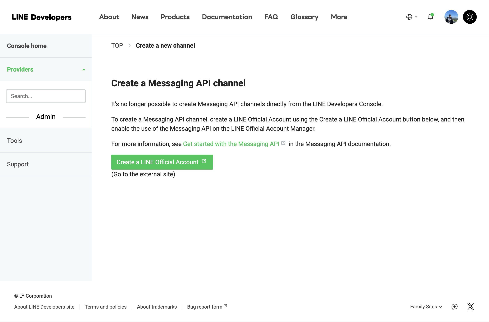
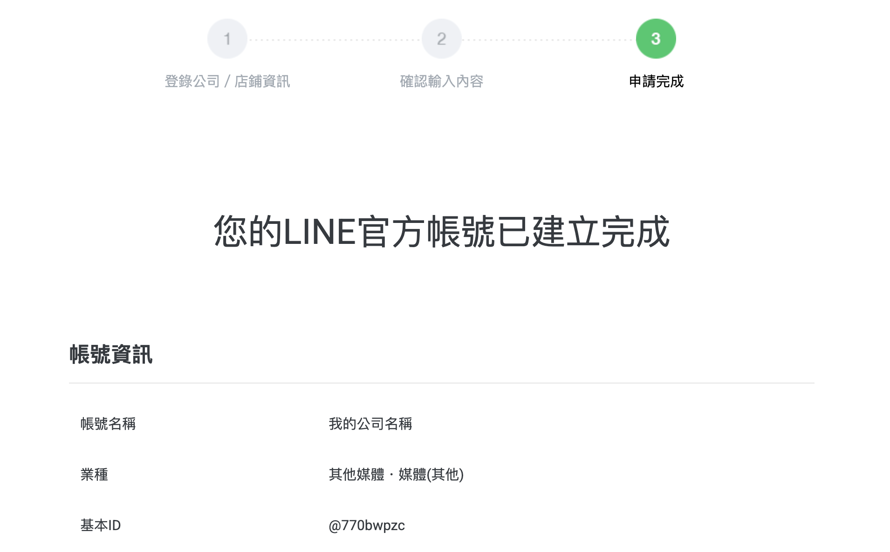
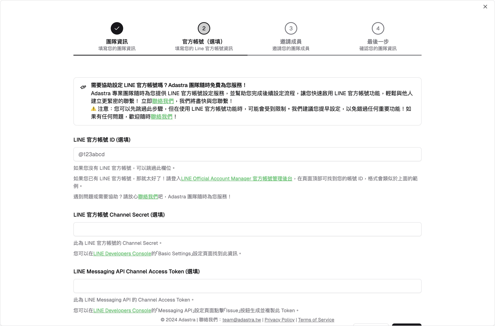

## 註冊或登入 Adastra 帳號

首先，您需要註冊或登入 Adastra 帳號，請前往 [Adastra 官方網站](https://adastra.tw/auth/register)，您首先會看到以下畫面：

您可以選擇使用：

1. Google 帳號：點擊「Google 登入」按鈕，您可以使用 Google 帳號來註冊並登入 Adastra
2. 電子郵件與密碼：填寫您的電子郵件與密碼，然後點擊「註冊」按鈕，您將會收到一封來自 Adastra 驗證信，請點擊信中的連結來啟用您的帳號

當您完成註冊或登入後，您可以隨時點擊此連結 [https://adastra.tw/dashboard](https://adastra.tw/dashboard) 來進入 Adastra 的工作空間。

> 進入 Adastra 的工作空間後，您可能會看到創建團隊的畫面，我們先不用理會，請繼續閱讀下一步驟。

## 創建一個新的 LINE 官方帳號與啟用 Messaging API

<Callout title="需要協助？">
  您可以[聯絡我們](https://adastra.tw/#contact)來幫助您創建 LINE 官方帳號與啟用
  Messaging API，並完成後續設定，我們隨時為您服務！
</Callout>

> 如果您已經有一個 LINE 官方帳號，您可以直接跳過此步驟。

現在，您需要創建一個屬於您的 LINE 官方帳號，請前往 [LINE Developers](https://developers.line.biz/console/)，並登入您的 LINE，您首先會看到以下畫面：

請點選「Providers」旁的「Create」按鈕，然後填寫您的 Provider 名稱，可以是您的公司名稱或您的名字，

然後點擊「Create」按鈕，您將會看到以下畫面：

請點擊「Create a Messaging API channel」按鈕：

您會看到：

點擊「Create a LINE Official Account」按鈕，並登入您的 LINE 帳號，然後填寫您的 LINE 官方帳號名稱、電子郵件帳號、公司所在國家或地區、公司名稱等資訊：

點擊「確定」按鈕後點擊「完成」，您將會看到以下畫面：

請先下滑後點選「稍後進行認證」，您就可以看到您的 LINE 官方帳號後台了，並自動地添加到您的 LINE 好友中：

現在，請點選右上角的「設定」按有，並點選「Messaging API」，然後點擊「啟用 Messaging API」按鈕，選擇您剛剛創建的 Provider：

點擊「同意」並點選「確定」後，就完成了 LINE 官方帳號的創建與 Messaging API 的啟用啦！。

> 更多請參考[LINE 官方教學](https://techblog.lycorp.co.jp/zh-hant/linebot-2024-create-steps)。

## 在 Adastra 中創建團隊並連結 LINE 官方帳號

現在，您需要在 Adastra 中創建一個團隊，請前往 [Adastra 工作空間](https://adastra.tw/dashboard)，如果您是第一次登入，您首先會看到以下畫面：

首先，填寫你的團隊名稱與描述：

點選右下角「繼續」後，我們進入到 LINE 官方帳號的連結畫面：

接下來，我們需要三個東西：1. LINE 官方帳號的 ID、2. LINE 官方帳號的 Channel Secret、3. LINE 官方帳號的 Channel Access Token，我們將一步步帶您取得這三個資訊。

> 您的這些資訊將被我們安全地保存在我們的伺服器上，並且不會被外洩（因為我們沒有提供任何 API 來讓任何外部人員取得這些資訊），請放心使用。

1. 首先，來到[LINE 官方帳號管理頁面](https://manager.line.biz/)，選擇您剛剛創建的 LINE 官方帳號，您會看到以下畫面：

   

   其中，綠色箭頭所指的就是您的 LINE 官方帳號 ID，請複製您的 LINE 官方帳號 ID，然後回到 Adastra 的畫面填入

2. 接下來，我們需要取得您的 LINE 官方帳號的 Channel Secret 與 Channel Access Token，請點選首先來到[LINE Developers](https://developers.line.biz/console/)，然後選擇您剛剛創建的 Provider 以及 Messaging API Channel，點擊「Basic Settings」後，請下滑到最下方，您會看到這個畫面：

   

   複製您的 Channel Secret 或點選旁邊的複製按鈕，到 Adastra 的畫面填入。

   > 如果您沒有看到 Channel Access Token，請點選「Issue」按鈕。

   再來，請滑到最上面點選「Messaging API」後，滑到最下方，點擊「Issue」，您會看到這個畫面：

   

   請一樣複製您的 Channel Access Token 或點選旁邊的複製按鈕，到 Adastra 的畫面填入。

3. 最後，請回到這個畫面並點選下一步：
   

<Callout title="遇到困難或需要協助？">
  請隨時[聯絡我們](https://adastra.tw/#contact)，我們隨時為您服務！
</Callout>

最後，您可以邀請您的同事或朋友加入您的團隊：

恭喜您！您已經完成了 Adastra 的快速開始教學，現在您可以開始使用 Adastra 的溝通渠道了！

## 下一步

<Cards>
  <Card title="開始使用聯絡人功能" href="/docs/channels/contacts" />
  <Card title="開始使用群組功能" href="/docs/channels/groups" />
</Cards>
