<Callout title="嘿 👋！Adastra 專業團隊隨時為您服務！">
  我們可以幫助您設定 LINE
  官方帳號、建立團隊並架設拰的第一個自動回覆機器人，或是任何其他問題。歡迎隨時[聯絡我們](https://adastra.tw/#contact)，讓我們的專業團隊為您服務！
</Callout>

## 1. 註冊或登入 Adastra 帳號

1. 前往 [Adastra 官方網站](https://adastra.tw/auth/register)，並看到以下畫面：  
   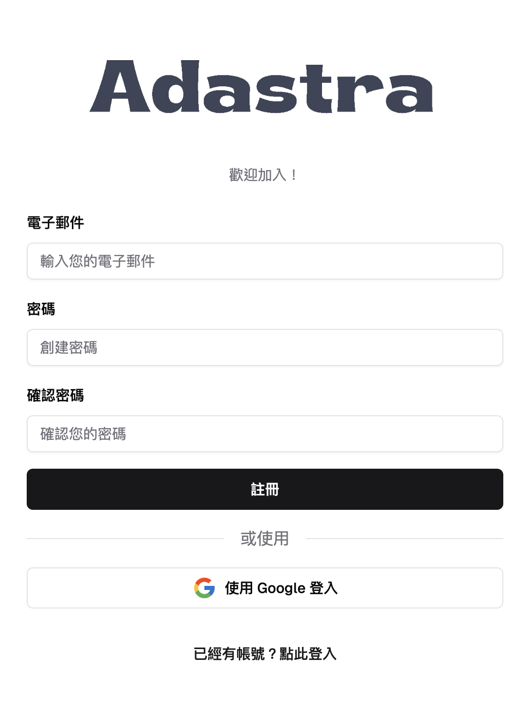
2. 您可以選擇以下任一方式註冊或登入：
   - **Google 帳號**：點擊「Google 登入」按鈕
   - **電子郵件與密碼**：填寫您的電子郵件與密碼後點擊「註冊」按鈕。您將會收到一封來自 Adastra 的驗證信，請點擊信中的連結啟用您的帳號。
3. 完成註冊或登入後，您可隨時透過 [https://adastra.tw/dashboard](https://adastra.tw/dashboard) 進入 Adastra 工作空間。

> 若登入後出現「創建團隊」畫面，先不用理會，可直接閱讀後續步驟再返回設定。

---

## 2. 創建 LINE 官方帳號並啟用 Messaging API

如果您已有 LINE 官方帳號並完成 Messaging API 啟用，可直接跳至 [第 3 步](#3-在-adastra-中創建團隊並連結-line-官方帳號)。

<Callout title="需要協助？">
  如果您對創建 LINE 官方帳號或啟用 Messaging API
  有疑問，或需要協助進行後續設定，歡迎隨時[聯絡我們](https://adastra.tw/#contact)！
</Callout>

### 2.1 創建 Provider 與 LINE Official Account

1. 前往 [LINE Developers](https://developers.line.biz/console/) 並登入您的 LINE 帳號：  
   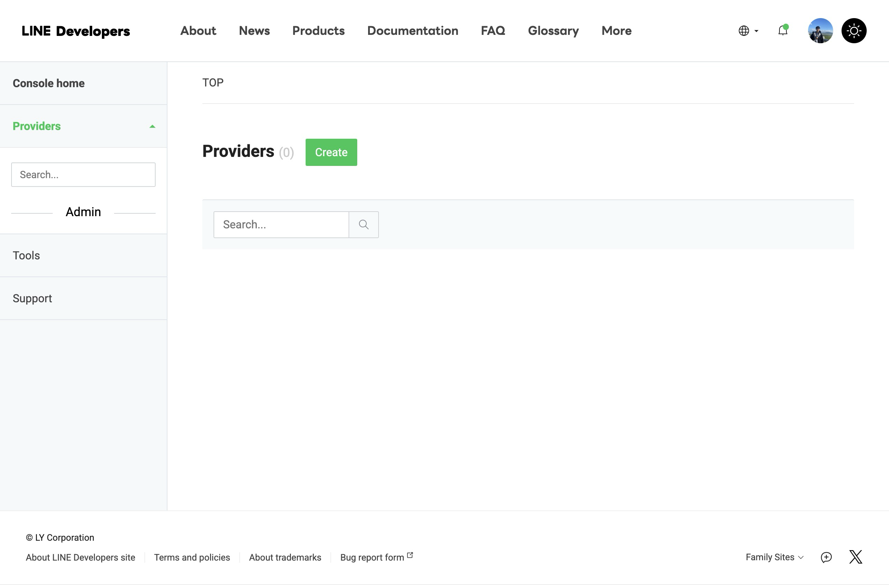
2. 點擊「Providers」旁的「Create」，填寫 Provider 名稱（公司名稱或個人名稱皆可），完成後會看到以下畫面：  
   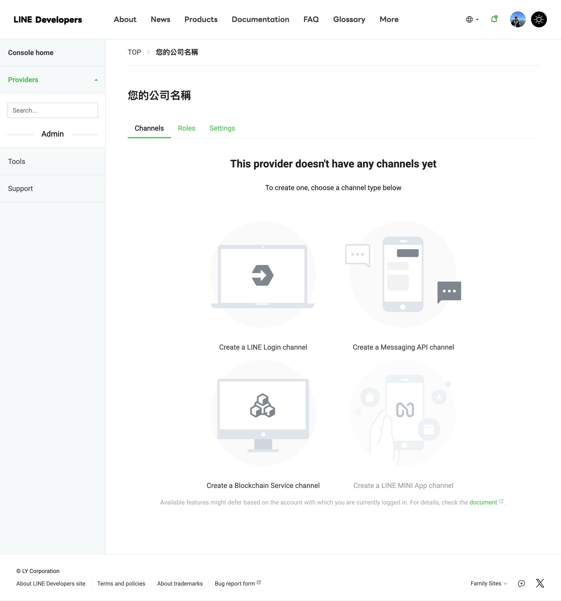
3. 點擊「Create a Messaging API channel」：  
   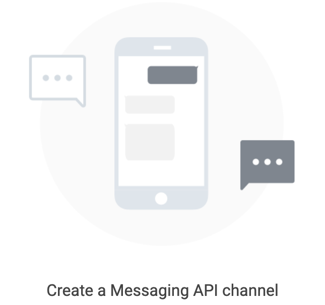
4. 在「Create a Messaging API channel」頁面，點擊「Create a LINE Official Account」，登入您的 LINE 帳號後，依序填寫 LINE 官方帳號名稱、電子郵件、所在地區、公司名稱等資訊：  
   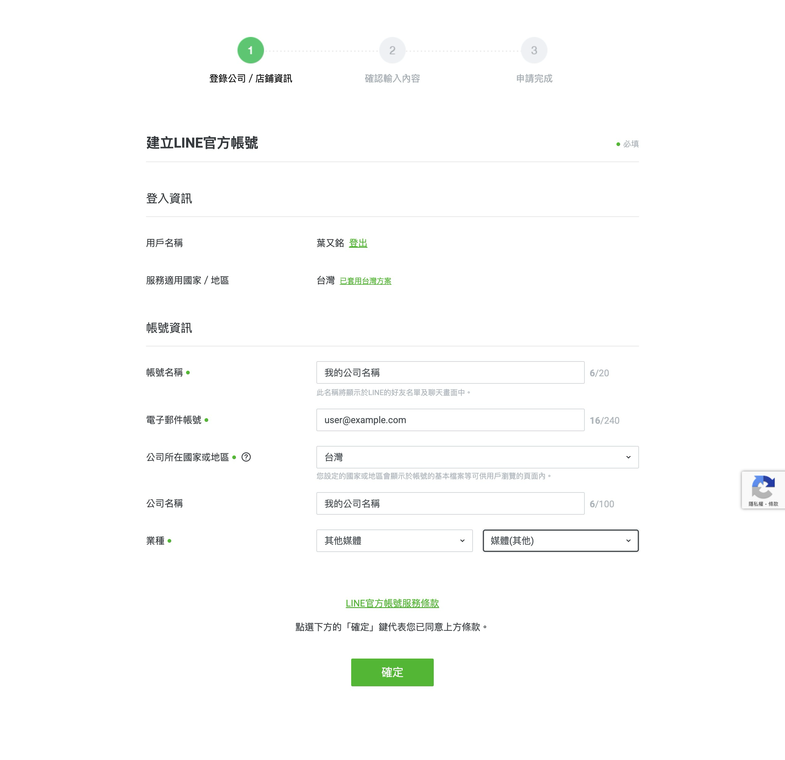
5. 點擊「確定」後再點「完成」，最後可選擇「稍後進行認證」。此時您已能進入 LINE 官方帳號後台，且該帳號也會自動加至您的 LINE 好友中：  
   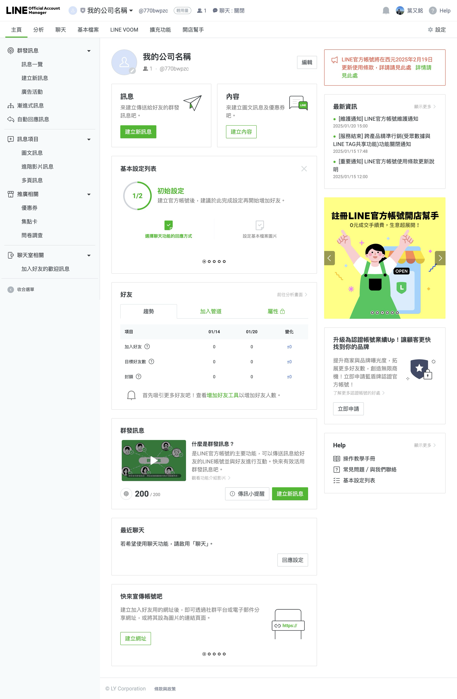

### 2.2 啟用 Messaging API

1. 進入 LINE 官方帳號後台，點擊右上角「設定」→「Messaging API」：  
   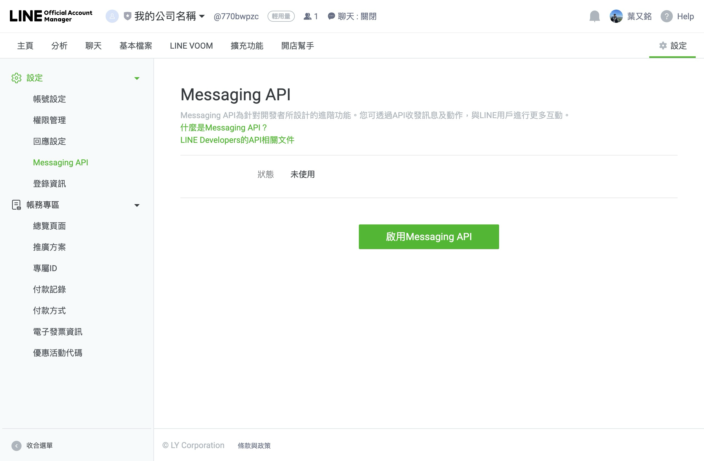
2. 點擊「啟用 Messaging API」按鈕，並選擇您剛創建的 Provider：
   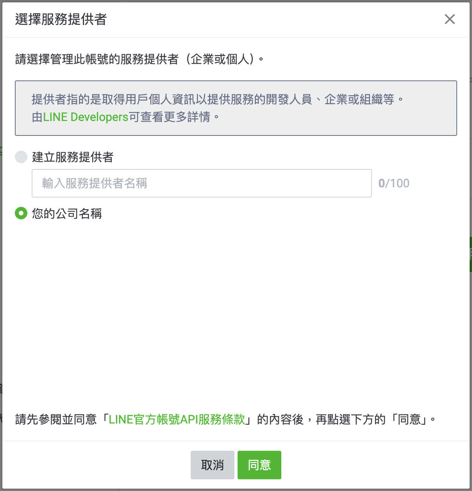
3. 點擊「同意」→「確定」後，LINE 官方帳號的 Messaging API 即成功啟用。

> 詳細流程可參考 [LINE 官方教學](https://techblog.lycorp.co.jp/zh-hant/linebot-2024-create-steps)。

---

## 3. 在 Adastra 中創建團隊並連結 LINE 官方帳號

### 3.1 創建團隊

1. 前往 [Adastra 工作空間](https://adastra.tw/dashboard)。若是初次登入，您將看到以下畫面：  
   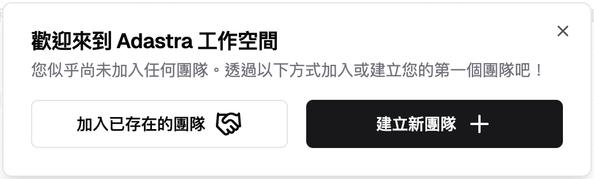
2. 選擇「建立新團隊 +」，填寫您的團隊名稱與描述：  
   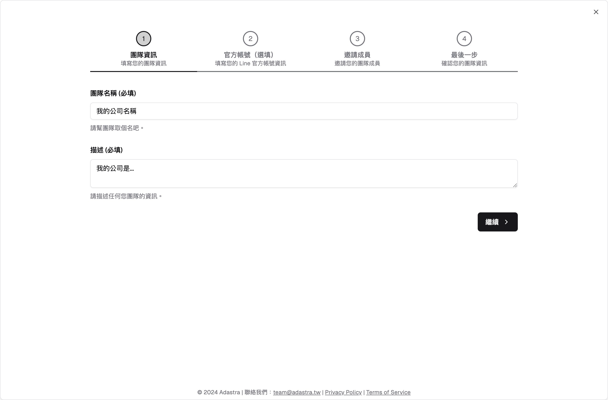
3. 點選右下角「繼續」，畫面會進入「連結 LINE 官方帳號」的設定頁面。

### 3.2 連結 LINE 官方帳號

1. 在 LINE 官方帳號管理頁面 ([manager.line.biz](https://manager.line.biz/))，選擇剛創建的 LINE 官方帳號，即可看到類似下圖：  
   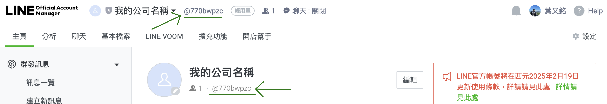
   - **LINE 官方帳號 ID**：綠色箭頭指示位置。請複製後回到 Adastra 的頁面貼上。
2. 前往 [LINE Developers](https://developers.line.biz/console/)，選擇對應 Provider 與 Messaging API Channel，點擊 **Basic Settings**，下滑至最底部可查看 **Channel Secret**：  
   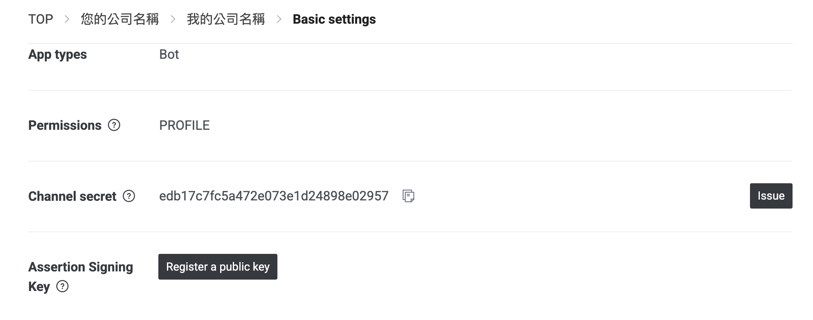
   - **Channel Secret**：可直接複製或點擊旁邊按鈕複製，貼到 Adastra 頁面。
3. 點擊上方 **Messaging API** → 下滑至最底並點擊 **Issue** 以取得 **Channel Access Token**：  
   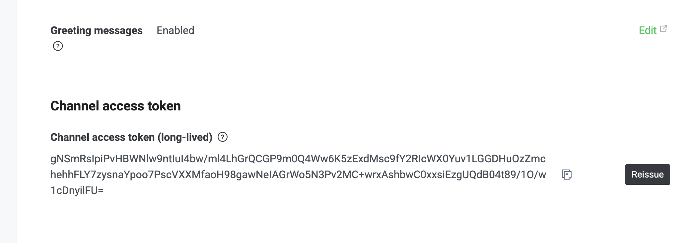
   - **Channel Access Token**：同樣可複製後貼到 Adastra 頁面。
4. 回到 Adastra 團隊設定畫面，確認已填寫 LINE 官方帳號 ID、Channel Secret、Channel Access Token，然後點擊「下一步」：  
   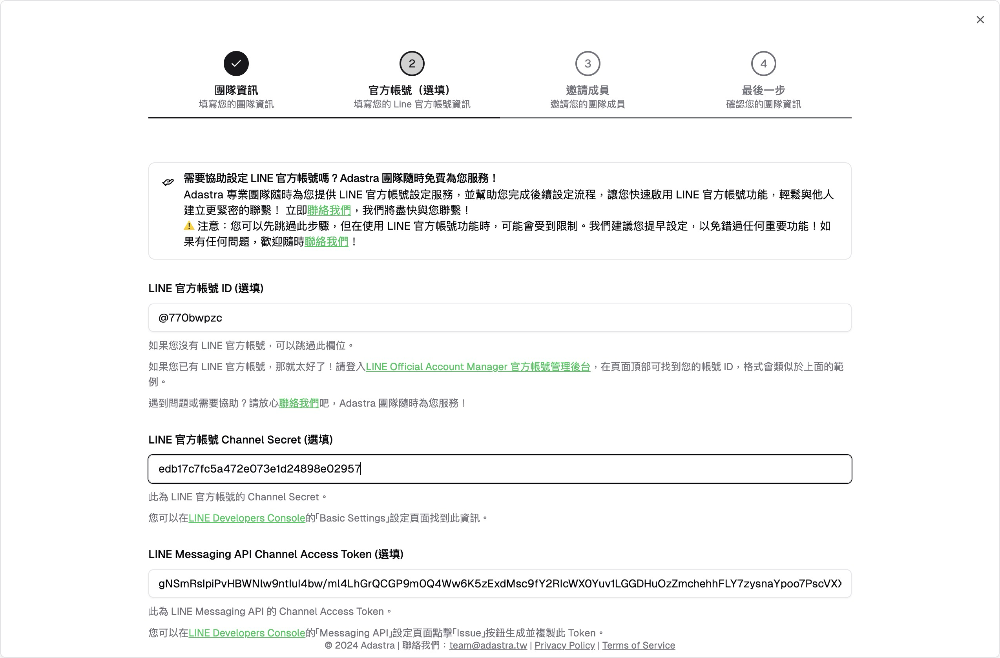

<Callout title="遇到困難或需要協助？">
  若您在任何步驟遭遇問題，歡迎[聯絡我們](https://adastra.tw/#contact)，我們隨時為您服務！
</Callout>

5. 您可以選擇邀請同事或朋友加入團隊：  
   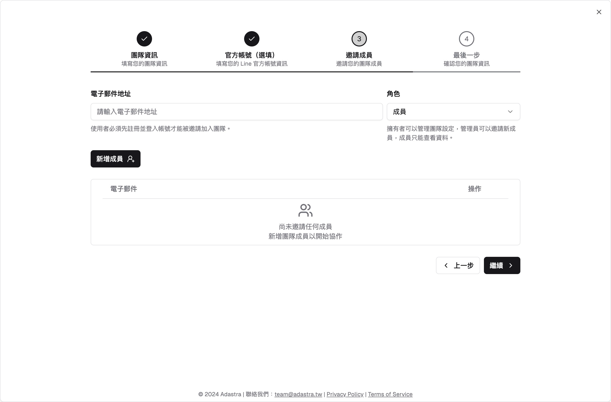  
   點選「繼續」後再點擊「創建團隊」，團隊便成功建立。

### 3.3 設定 Webhook URL

1. 在 [LINE Developers](https://developers.line.biz/console/) 選擇您的 Messaging API Channel → 點擊「Messaging API」。
2. 找到 **Webhook URL** 欄位，填入 Adastra 提供的 Webhook URL（在 Adastra「LINE 官方帳號設定頁面」可找到）：  
   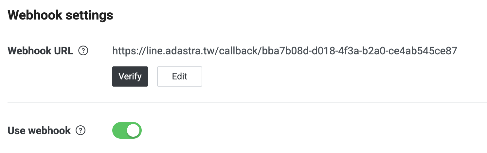
3. 點擊「Update」後，點擊「Verify」驗證是否成功。
4. 最後，開啟 **Use Webhook** 開關，即成功完成 LINE 官方帳號的連結與設定。

---

## 4. 恭喜您完成設定！

恭喜您 🎉！您已完成 Adastra 的快速開始教學。現在可透過 LINE 官方帳號與您的用戶互動，並使用 Adastra AI 自動回覆功能。

## 下一步

<Cards>
  <Card title="開始使用聯絡人功能" href="/docs/channels/contacts" />
  <Card title="開始使用群組功能" href="/docs/channels/groups" />
</Cards>

若有任何問題或需要進一步協助，歡迎隨時[聯絡我們](https://adastra.tw/#contact)！祝您使用愉快。
