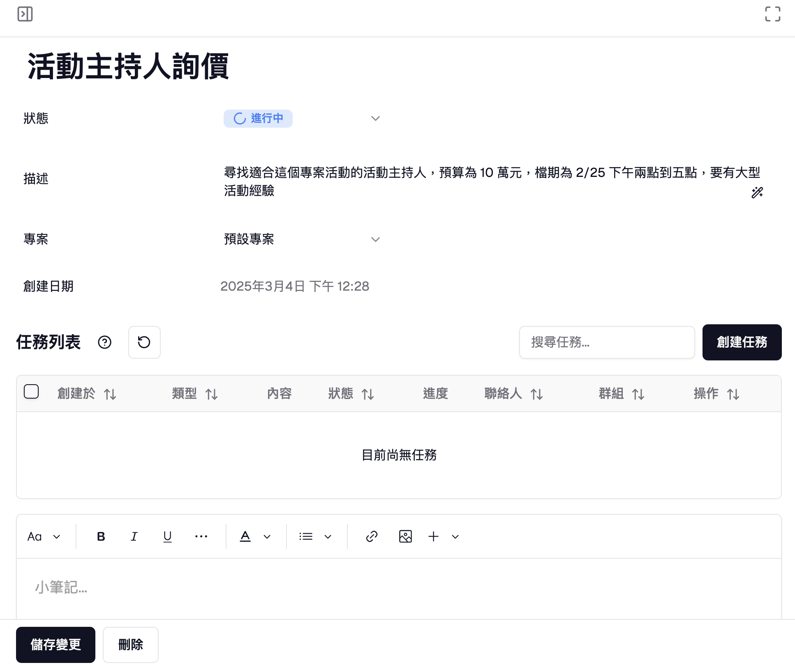

<Callout title="嘿 👋！Adastra 專業團隊隨時為您服務！">
  我們可以幫助您設定 LINE
  官方帳號、建立團隊並架設拰的第一個自動回覆機器人，或是任何其他問題。歡迎隨時
  [聯絡我們](https://adastra.tw/#contact)，讓我們的專業團隊為您服務！
</Callout>

## 1. 註冊或登入 Adastra 帳號

1. 前往 [Adastra 官方網站](https://adastra.tw/auth/register)，並看到以下畫面：
   
2. 您可以選擇以下任一方式註冊或登入：

- **Google 帳號**：點擊「Google 登入」按鈕
- **電子郵件與密碼**：填寫您的電子郵件與密碼後點擊「註冊」按鈕。您將會收到一封來自 Adastra 的驗證信，請點擊信中的連結啟用您的帳號。

3. 完成註冊或登入後，您可隨時透過 [https://adastra.tw/dashboard](https://adastra.tw/dashboard) 進入 Adastra 工作空間。

> 若您已創建團隊，請跳至 [第 3 步](#3-在-adastra-中創建第一個待辦事項)。

-

## 2. 在 Adastra 中創建團隊

### 2.1 創建團隊

1. 前往 [Adastra 工作空間](https://adastra.tw/dashboard)。若是初次登入，您將看到以下畫面：
   
2. 請參考 [創建團隊教學](/docs/channels/getting-started) 來創建並設置您的第一個團隊。

-

## 3. 創建代辦事項

1. 前往 [Adastra 工作空間](https://adastra.tw/dashboard)，您會看到以下畫面

2. 點擊右上角「創建待辦事項」，選擇你想要「創建單一待辦事項」、「一次創建多個待辦事項」、「透過 AI 輔助創建」，我們先選擇「創建單一待辦事項」

3. 輸入這個待辦事項的名稱以及描述，盡量可以把你的需求填寫完整，也可以點擊「描述」旁的魔法棒，讓 AI 幫助你調整內容，狀態選擇「進行中」，代表這個任務已經開始著手進行，你也可以指定到某個專案來更好地管理這個待辦事項。如下圖：

4. 接著點擊創建，您就會在待辦事項區塊中看見您剛剛新增的待辦事項，點擊最右方的按鈕可以檢視並管理待辦事項，以及其子任務

5. 點擊最右方的按鈕開啟並檢視並管理待辦事項，您會看到如下圖：

6. 點擊「創建任務」來創建此待辦事項的子任務，我們選擇「基本聯絡任務」，按照指示輸入您的需求、目標，您可以使用魔法棒幫助您寫的更完善：

> 聯絡人欄位中，您可以選擇您這個任務要聯絡的聯絡人

7. 點擊創建就完成啦！現在，點擊「查看聯絡人」來傳送您的第一則訊息吧！（可以讓 AI 幫你想要說什麼喔！）

## 下一步

聯絡我們探索各種使用情境！若有任何問題或需要進一步協助，歡迎隨時 [聯絡我們](https://adastra.tw/#contact)！祝您使用愉快。
